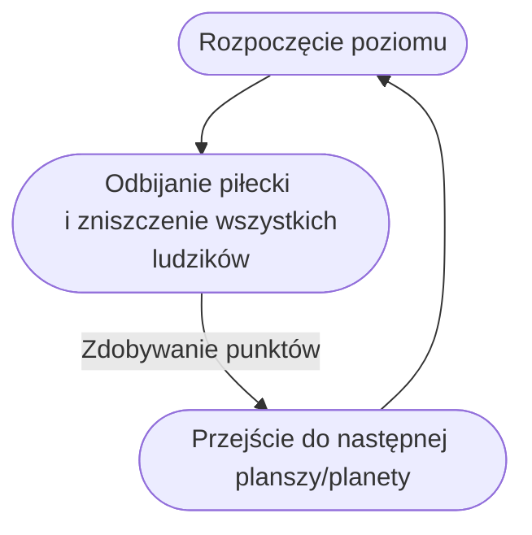

# Breakout 2020

## Spis treści

1.  [Opis projektu](#opis-projektu)
2.  [Fabuła](#fabula)
3.  [Cel dla gracza](#cel-dla-gracza)
4.  [Zarys gameplay'u](#zarys-gameplayu)
    1. [Podstawowy UI](#podstawowy-ui)
    2. [Podstawowa mechanika](#podstawowa-mechanika)
    3. [Struktura gameloop'a](#gameloop)
    4. [Dynamika](#dynamika)

## 1. Opis Projektu 

**Breakout 2020** to arkadowa gra 2D z gatunku breakout. Gracz wciela się w wirusa, którego odbija za pomocą ruchomej paletki. Wirus rozbija cegiełki imitujące wygląd małych człowieczków. Jego celem jest rozbicie wszystkich ludzików co pozwoli mu na przejście do następnego poziomu i zdobycie jak największej ilośc punktów.

## 2. Fabuła 

Gracz wciela się w rolę wirusa, który przemieszcza się od planety do planety i unicestwia życie na każdej z nich. Na każdej planecie, czyli na każdym kolejnym poziomie, gracz poznaje nowe istoty, które unicestwia, a wirus mutuje pomiędzy każdym poziomem przyjmując nową postać i nabywając nowe możliwości.

## 3. Cel dla gracza 

Celem samym w sobie jest zdobycie jak największej ilości punktów i próba pobicia swojego rekordu natomiast gracz może sam wyznaczać sobie cele, np. dojście do określonego momentu w rozgrywce lub jak najszybsze przejście poziomu.

## 4. Zarys gameplay'u 

### 4.1 Podstawowy UI 

Gracz rozpoczyna rozgrywkę klikając dowolny klawisz. Wyświetlana jest plansza 2D na której znajdują się odpowiednio: paletka do odbijania na dole ekranu, ludziki które rozbija gracz na górze ekranu, piłeczka imitująca wygląd wirusa, która odbija się od wszystkiego na co wpadnie oraz punktacja przedstawiająca aktualny wynik.

### 4.2 Podstawowa mechanika 

Po rozpoczęciu rozgrywki z dołu ekranu wylatuje wirus odpowiedni dla danej planszy.
Wirus odbija się od każdej powierzchni pod kątem, w którym w dany obiekt wleciał i leci dalej. Gracz poruszając paletką z dołu ekranu za pomocą klawiszy odbija wirusa z powrotem w stronę ludzików. Wirus uderzając w ludzika sprawia, że znika. Jeżeli gracz nie zdoła odbić wirusa - przegrywa.

### 4.3 Struktura gameloop'a 

### 4.4 Dynamika 

Każda planeta ma swoje unikalne mechaniki.
